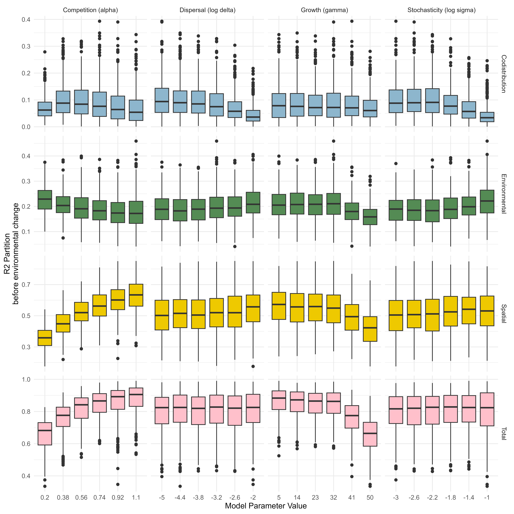
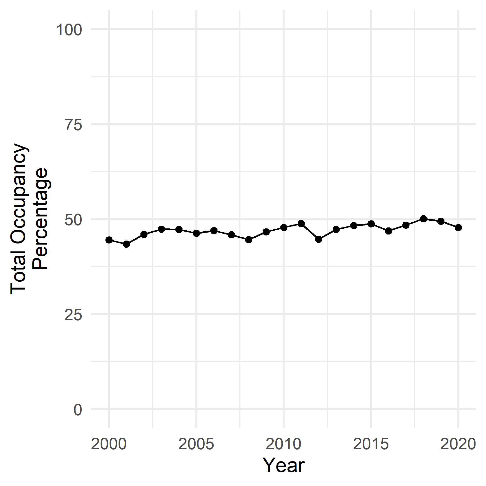

```{r setup, include=FALSE}
knitr::opts_chunk$set(echo = TRUE)
```

\newpage

# Simulations

##  Simulation Setup Example
  
![Example illustration of the simulation model grid and impact of directional change in the values of an environmental variable. Values are drawn from the same simulation as illustrated in the main text Figure 2.  Values from the peripheral nodes not used for the JSDM fitting are shown greyed out. a) Initial distribution of $E_1$. b) Distribution of $E_2$. c) Growth rate $R$, of an example species before the onset of climate change. Note the approximately circular shape, but the high degree of heterogeneity. d) Growth rate R of the example species after 25 time steps of climate change ($t=25$). Note the leftwards shift in the optimal (bright colours) habitat.  e) Pre-climate change distribution of an example species. Note the approximate correspondence with the growth rates, but also infilling due to dispersal mass-effects f) Mid-climate change distribution of the example species. Note the movement lags - the shift leftwards movement is not as noticeable as in the growth rates (d).](SimulationMarkdowns/Figures/SimulationExample.png){height=50%}

## Impact of parameters on metacommunity size and occupancy


## Impact of parameters on simulated metacommunity structure



## Impact of parameters on shift in simulated metacommunity structure


## Impact of false absences on detectability of shift in metacommunity structure


![Impact of false absences on the consistent identity of trends.  Simulation was run as with the analysis in the main text, but with a reduced spread of core model parameters ($\delta$: $10^{-5}, 10^{-4}, 10^{-3}$;  $\alpha$; $0.3, 0.8, 1.1$, $\gamma$: $5, 20, 40$, $\sigma$: $10^{-3}, 10^{-2}, 10^{-1}$), crossed with 4 levels of false absences ($0, 0.05, 0.1, 0.2$). False absences are introduced by randomly, and independently, switching each presence (i.e. above threshold) to an absence with a given probability. Boxplots hinges show 25 and 75th percentiles. ](SimulationMarkdowns/Figures/FalseAbs.png) 


# Butterfly Dataset


## Distribution of Sites


## Occupancy Through Time




## Species-Level Responses


\newpage
## Species Names

```{r echo = FALSE, message = FALSE, warning =FALSE}
library(tidyverse)
library(knitr)

ExampleModelFit<-read_csv( 'SavedObjects/HMSC_Bf2_perc2_log_env/vpDF_Y_2000.csv',
                           show_col_types = FALSE)
ButterflyNames <- read_csv('Data/ButterflyNames.csv', show_col_types = FALSE)

ButterflyNames %>%
  filter(SciName%in%unique(ExampleModelFit$Species) ) %>%
  arrange( CommName) %>%
  mutate(SciName = paste0("\\textit{", SciName, "}")) %>%
  select( `Scientific Name`=SciName, `English Common Name`= CommName ) %>%
  kable(caption = 'Linnean binomials and English common names of focal butterfly species')
```


## Fitted Environmental Coefficients

{height=70%}


## Fitted Species Associations

{height=80%}

## Confirming Model Convergence


![Histogram of Gelman-Rubin MCMC convergence statistics across all years of the butterfly dataset based on two independent chains  fit for each year of the full model (total iterations = 100000, burn-in = 50000, and thinning = 50)  a) Main effect coefficients (i.e. environmental and spatial coefficients) are all well below the standard threshold of 1.1, indicating acceptable convergence. b) Equivalent results for the species codistribution fitting are by necessity slightly more derived, as they are fit by latent variables that might not necessarily be fit in the same order, even if they converge. We therefore examine the convergence in the elements of the correlation matrix $\Omega$. Here the vast majority are well converged, although there are a few correlations that exceeded 1.2. However, as these were very much a minority and were not signifcantly over (the maximum was 1.29), we considered these models suitable converged.  ](ButterflyMarkdowns/ButterflySIFigs/ButterflyConvergence_GR.png)

# Birds

## Distribution of Sites


\newpage
## Species Names

```{r echo = FALSE}
load('BirdData_clean/finalSP_HQ' )
load('BirdData_clean/finalSP_all' )

read_csv('BirdData_clean/species_lookup.csv', show_col_types = FALSE) %>%
  filter( english_name %in% finalSP_all) %>%
  mutate( HQ = english_name %in% finalSP_HQ) %>%
  arrange( english_name) %>%
    mutate(scientific_name = paste0("\\textit{", scientific_name, "}")) %>%
  select( `Scientific Name`=scientific_name, 
         `English Common Name`= english_name,
          HQ)%>%
  kable(caption = 'Linnean binomials and English common names of focal bird species. "HQ" column indicates if the species had sufficient "high-quality" observations to be retained in the more restricted datasets.' )
```

## Species Habitat Associations

{height=70%}


## Species Codistribution

{height=70%}

{height=70%}


## MCMC Convergence


![Distribution of Gelman-Rubin MCMC convergence diagnostic value point estimates for the bird datasets, calculated from 4 independent MCMC chains of the 'full' model. Values are faceted by year and whether all data is used, or excluding 'possible' observations (HQ). a) Main effect coefficients (i.e. environmental and spatial variables). Largest value was 1.069. b) Elements of the correlation matrix ($\Omega$). Largest value was 1.102.   All were well below the standard thresholds indicating convergence is likely achieved. ](BirdMarkdowns/BirdImages/ModelCovergence.png)

